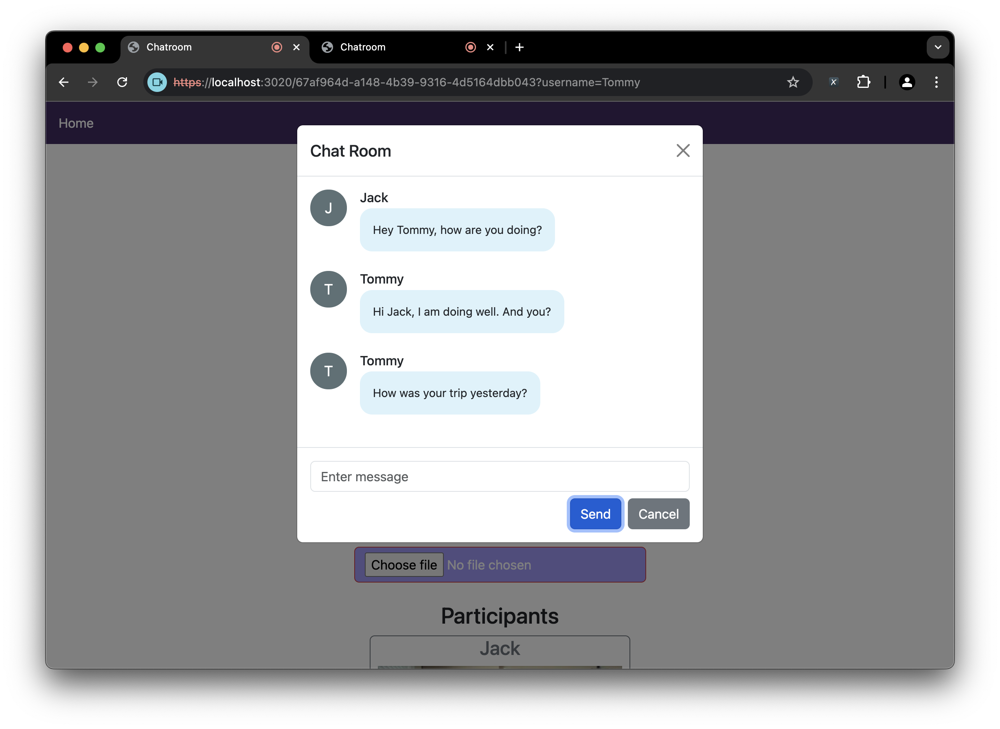

# Peer-to-Peer Video Chat Web Application

> This project is an extension of the final project of CSCI3280 Intro to Multimedia at CUHK

## Project Overview

This project is a web-based application that creates a peer-to-peer (P2P) voice chat room, enabling voice calling between multiple computers.

## Gallery




## System Features

### Basic Features

#### Chat Room Creation
- Users can create new chat rooms that allow others to join.

#### Chat Room List
- A list of available chat rooms is displayed in the application.
- Users can select and join a chat room of their interest.

#### Joining the Chat Room
- Users can join chat rooms to participate in real-time communication.

#### Basic GUI
- A user-friendly GUI is designed for a smooth user experience.

### Multi-User Voice Chat

> **Declaration:** The multi-user voice chat feature is adapted from the tutorial [How To Create A Video Chat App With WebRTC](https://www.youtube.com/watch?v=DvlyzDZDEq4&t=1100s).

#### Support for Multiple Users
- Multiple users can join the same chat room.

#### Continuous Voice Communication
- Provides a smooth and uninterrupted conversation experience.

#### Simultaneous Voice Speaking
- Users can speak concurrently for a natural conversation flow.

#### Microphone Control
- Mute/Unmute buttons are available to control the user's microphone.

### Record
- All user voices are captured and can be downloaded.

#### Start/Stop Function
- A Start/Stop button is provided for recording.

### Enhanced Features

#### Real-Time Video Streaming
- The user stream includes both audio and video.

#### Messaging
- Users can send messages to others in the room.

#### Karaoke System
- Users can input a file to remove the vocal track and sing along in front of other users.


## Usage
To run this application, execute:
```
$ npm run devStart
```
This will start a https server on https://localhost:3000.  

Note: If you are using CUHK1x WiFi, you may want to share your mobile network to your computer and launch the server using your mobile network. CUHK1x uses NAT which makes communication difficult in the local network.  


### Accessing the Application

When a user visits `https://localhost:3000`, they will arrive at the homepage. Each chat room is distinguished by a unique room ID. Users can check if the chat room they want to join already exists; if it doesn't, they can create a new chat room by clicking the **Create New Chatting Room** button.

To join a chat room, simply click the **Join Room** button. The application will prompt the user to enter their username for display. After that, you can start chatting! The homepage at `https://localhost:3000` also allows users to remove chat rooms when needed.

Once in the chat room, a media access request will be prompted. Inside the chat room, several buttons are available for users to control audio, video, send messages, or input music files for vocal removal. Users can leave the chat room by clicking "Home" in the navigation bar.

### Example Steps

1. **Launch the Application**
2. **Visit** `https://localhost:3000`. You will be directed to the homepage.
3. **Check for Existing Chat Rooms**:
   - Look for a chat room with the desired room ID.
   - If it exists, click the **Join Room** button next to it.
   - If it doesn't exist, click the **Create New Chatting Room** button.
4. **Enter Your Username**: When prompted, input your username for display in the chat.
5. **Allow Browser Access**: Grant permission for the browser to access your microphone and camera.
6. **Start Chatting**: Once inside the chat room, you can begin chatting and using the available features.
7. **Leave the Chat Room**: To exit, click "Home" in the navigation bar.

