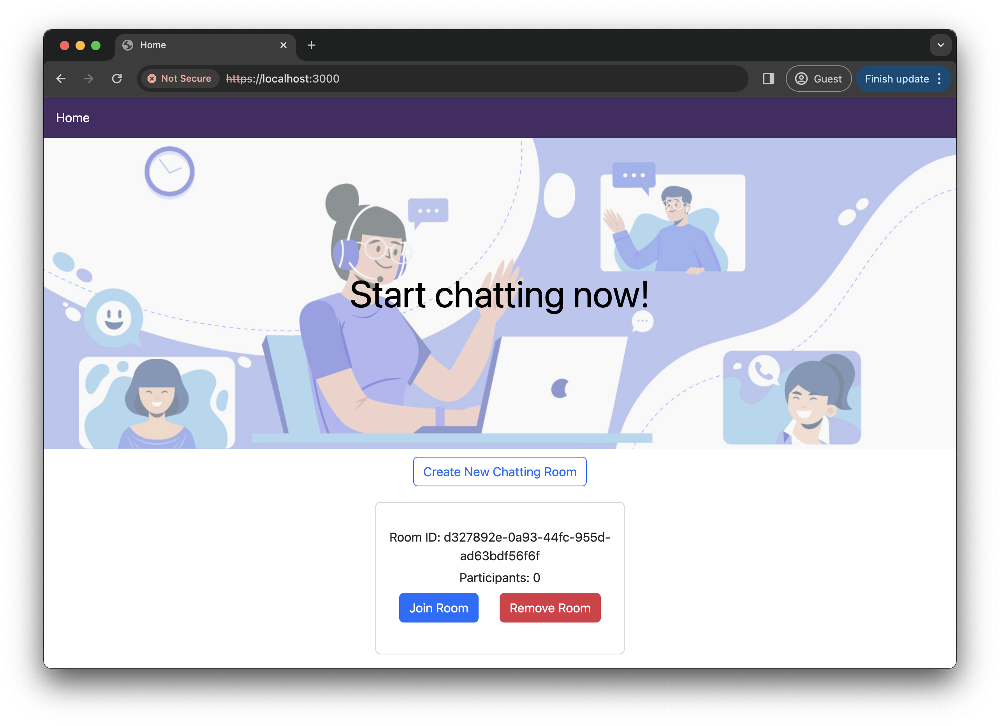
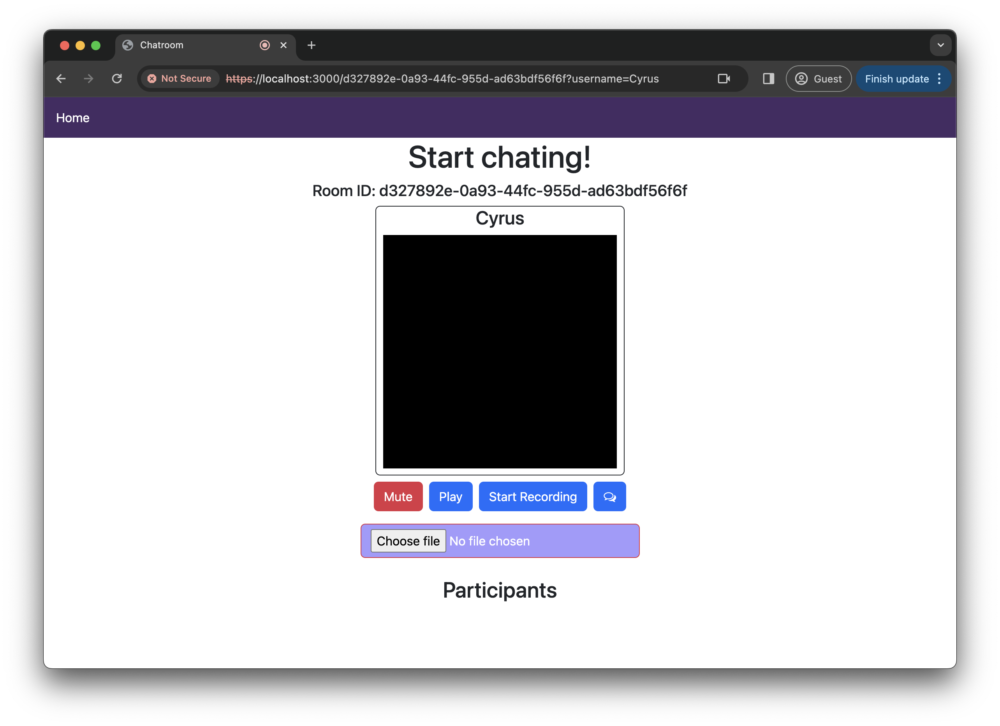

# Peer-to-Peer Video Chat Web Application

> This project is an extension of the final project of CSCI3280 Intro to Multimedia at CUHK

## Project Overview

This project is a web-based application that creates a peer-to-peer (P2P) voice chat room, enabling voice calling between multiple computers.

## Gallery




## System Features

### Basic Features

#### Chat Room Creation
- Users can create new chat rooms that allow others to join.

#### Chat Room List
- A list of available chat rooms is displayed in the application.
- Users can select and join a chat room of their interest.

#### Joining the Chat Room
- Users can join chat rooms to participate in real-time communication.

#### Basic GUI
- A user-friendly GUI is designed for a smooth user experience.

### Multi-User Voice Chat

> **Declaration:** The multi-user voice chat feature is adapted from the tutorial [How To Create A Video Chat App With WebRTC](https://www.youtube.com/watch?v=DvlyzDZDEq4&t=1100s).

#### Support for Multiple Users
- Multiple users can join the same chat room.

#### Continuous Voice Communication
- Provides a smooth and uninterrupted conversation experience.

#### Simultaneous Voice Speaking
- Users can speak concurrently for a natural conversation flow.

#### Microphone Control
- Mute/Unmute buttons are available to control the user's microphone.

### Record
- All user voices are captured and can be downloaded.

#### Start/Stop Function
- A Start/Stop button is provided for recording.

### Enhanced Features

#### Real-Time Video Streaming
- The user stream includes both audio and video.

#### Messaging
- Users can send messages to others in the room.

#### Karaoke System
- Users can input a file to remove the vocal track and sing along in front of other users.


## Usage
To run this application, execute:
```
$ npm run devStart
```
This will start a https server on https://localhost:3000.  

Note: If you are using CUHK1x WiFi, you may want to share your mobile network to your computer and launch the server using your mobile network. CUHK1x uses NAT which makes communication difficult in the local network.  


### Accessing the Application
Each time a user visits https://localhost:3000, they will be directed to a new and unique chat room. The URL format for a chat room is:

```
https://host.ip.address:3000/some-unique-chat-room-id
```
To join a chat room, simply visit the same URL.
The home page at https://localhost:3000 allows users to create new chat rooms. After creating a new chat room, users can choose to delete it or scroll down to join other chat rooms.
When users click to join, they will be directed to:

```
https://host.ip.address:3000/some-unique-chat-room-id
```
A media access request will be prompted. Inside the chat room, there are several buttons for users to control audio, video, send messages, or input music files for vocal removal. Users can leave the chat room by clicking "Home" in the navigation bar.

### Example Steps
1. Launch the Application
2. Visit https://localhost:3000/. You will automatically be directed to a URL like: https://localhost:3000/3b8e3379-392b-4a74-b178-c2e7be291374.
3. Joining the Same Chat Room:
  - On the Same Computer: Use the same URL.
  - On Another Device: Find the host computer's IP address in the local network. Replace localhost with that IP address, resulting in a URL like: https://172.20.10.2:3000/3b8e3379-392b-4a74-b178-c2e7be291374.
4. Allow Browser Access: Grant permission for the browser to access your microphone and camera.
5. Have Fun!

